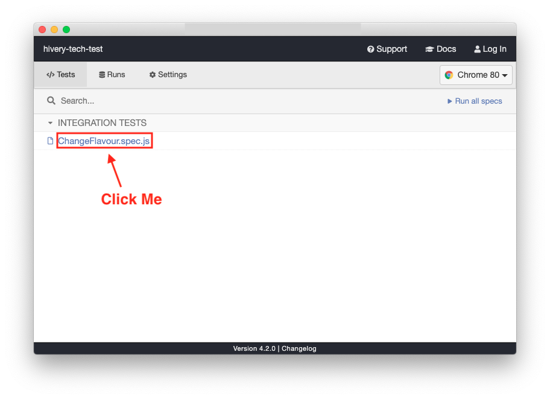

# Hivery Technical Test

Thank you for considering my application! This directory contains my attempt at the technical test that was given.

## Setup

```sh
yarn
yarn watch
```

This will open up a server at `http://localhost:1234` where this app is hosted.

## Testing

I included both unit and E2E tests in this project, utilising visual regression snapshots for my E2E tests. The unit tests are done using Jest and React Testing Library, and the E2E tests are done using Cypress.

To run unit tests:

```sh
yarn test
```

To run Cypress E2E tests:

```sh
yarn test:cypress
```

After this, please click the link shown below:



This will run the automated E2E/visual regression tests!

## Assumptions I Made

1. I attempted this tech test over the course of two days. I did not complete all the features (specifically, the graph does not have the relevant tooltips, and also cannot expand into each individual cannibalised product), however this was due to time constraints. Given more time I would have liked to:
   - Build out these two features on the graph; and
   - Look at making the graph more reusable for different circumstances.
2. Unsure of which charting library to use, I ended up going with D3. This was a conscious decision made after reviewing multiple charting libraries available, and how easily they would be able to match the design shown in the template. Choosing D3 allowed me to strive for a pixel-perfect design instead of accepting compromises. The charting libraries I considered were:
   - reaviz (had many bugs in open issues on GitHub); and
   - nivo (could not find evidence of support for horizontal non-zero bar charts).
3. Given the large number of products being rendered, I decided to use `react-window` to virtualise the items and improve performance.
4. I set up ESLint based upon configuration settings I've used in past projects, and enforced this across the codebase and also when running `yarn test`.
5. I tried to replicate the provided design as much as possible, including the use of the right colours. You can see inside of `src/styled-components/theme.js` that I used a large number of colours - these were taken directly from the provided design.
6. I used Parcel over Webpack/Create React App simply for the sake of convenience. I prefer to use Webpack for its power in larger-scale projects, but decided to go with Parcel for this one.

## Demo Recording

I've included a recording of me using the app - you can find this under this repository at [App Demo.mp4](./App%20Demo.mp4).
